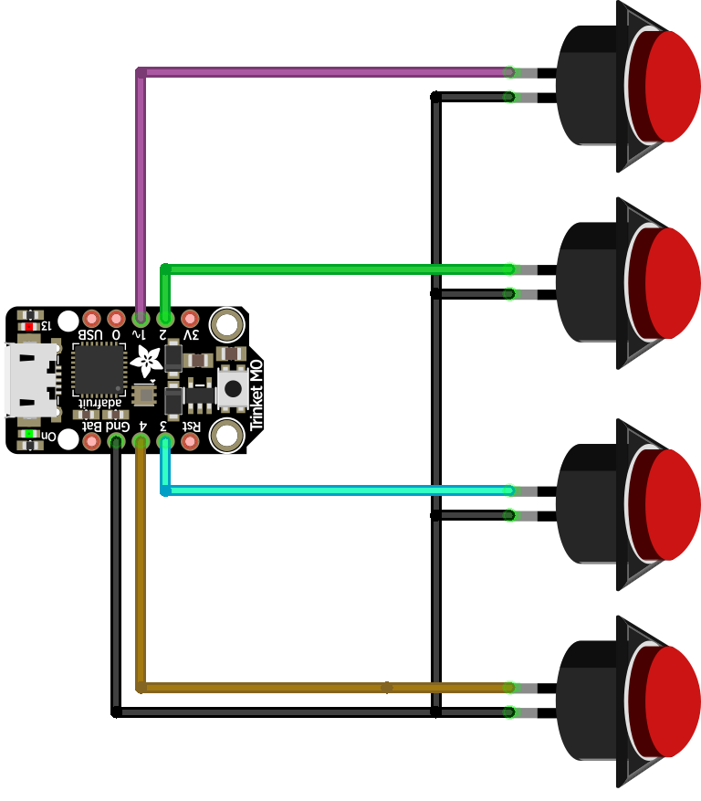

# MIDIPedalBox

## Wiring  

The wiring is pretty straight-forward. A single wire goes from each button to pins 1,2,3,4 and a common ground connecting everybody.

## Trinket M0 + CircuitPython USB MIDI Pedal Box
